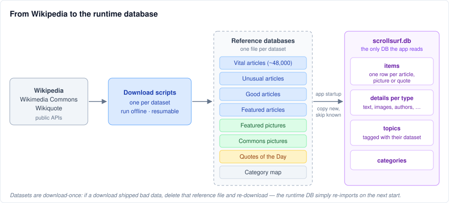
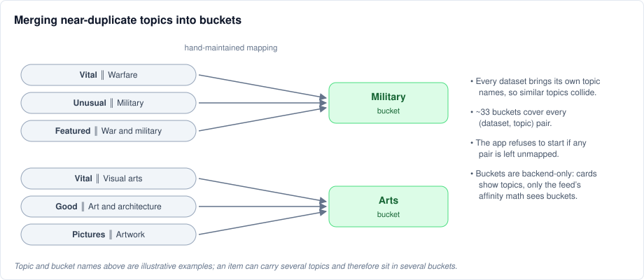
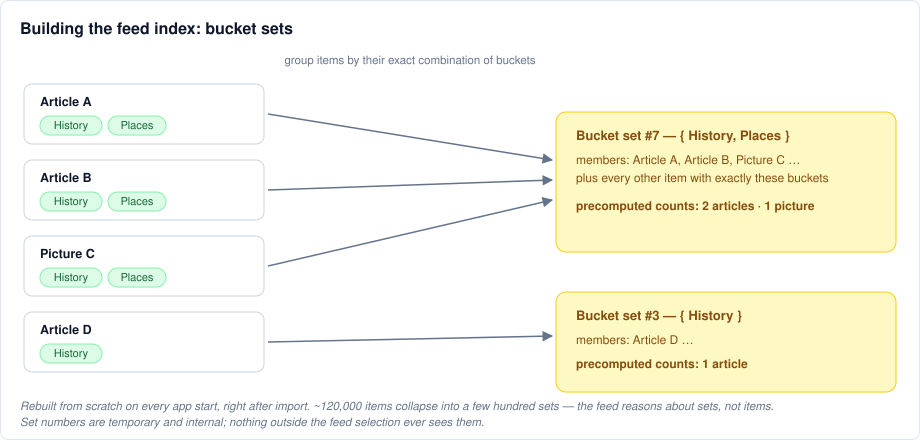
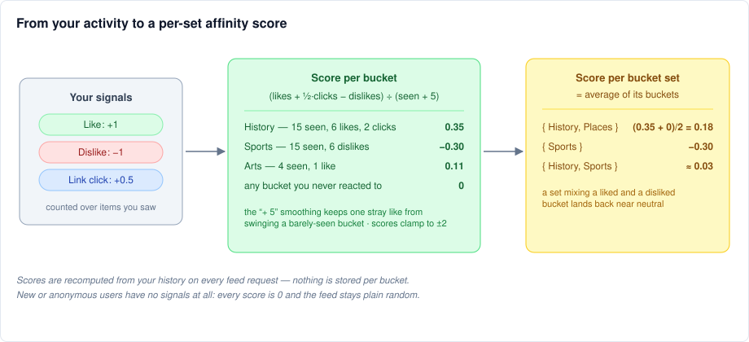
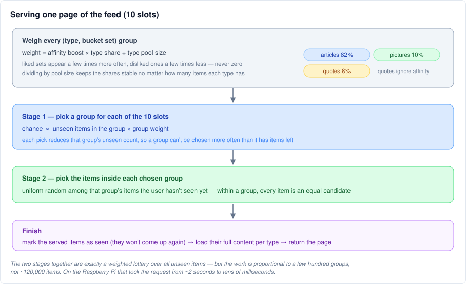

# How data flows through ScrollSurf

ScrollSurf is an endless feed of Wikipedia articles, pictures and quotes. The feed is random, but it slowly leans toward what you like and away from what you dislike. This document follows the data from Wikipedia all the way to a served feed page — no code, no SQL, just the flow. The math and the queries behind the feed live in [Feed.md](Feed.md).

## 1. Import: getting content into the app

Content never enters the app directly from the internet. It arrives in two separate steps:

1. **Download scripts** (run manually, offline) fetch curated collections from the Wikipedia family of sites — vital articles, unusual articles, good and featured articles, featured pictures, quotes of the day, and a map of Wikipedia's category hierarchy. Each script writes its result into its own small **reference database** file. The scripts are resumable and deliberately slow, respecting Wikipedia's API etiquette.
2. **On every app start**, the reference databases are imported into the single **runtime database** the app reads from. The import only copies rows it hasn't seen before, so restarting is cheap and safe. A missing or broken reference database is skipped with a warning — the app still starts with whatever it has.

Reference databases are treated as immutable snapshots: there is no repair or backfill machinery. If a download bug shipped bad data, the fix is to delete that reference file and download it again.

Every imported item lands in a unified **items** list (one row per article, picture or quote), with its type-specific details (text, image, author, …) stored alongside. Each item also brings its **topics** — and every topic remembers which dataset it came from, which matters next.

## 2. Topics and buckets

Each dataset labels its items with its own topic names: the vital-articles list has sections like *People* and *Geography*, the unusual-articles page has *Military* and *Folklore*, the picture galleries have their own headings. The result is many near-duplicate topics — one dataset's *Warfare* is another's *Military*.

For the feed to learn anything useful from a like, these need to be merged. A hand-maintained mapping assigns every (dataset, topic) pair to one of roughly 33 coarser **buckets**:

Two rules keep this honest:

- **The mapping must be complete.** If an import brings in a topic pair that has no bucket, the app refuses to start rather than serve a feed with blind spots. New pairs get mapped by re-running the (partly manual) unification step.
- **Buckets never reach the user.** Cards show the original topics and datasets; buckets exist only for the feed's preference math.

An item can have several topics and therefore belong to several buckets — a war-photography picture might sit in both *Military* and *Arts*.

## 3. The feed index: bucket sets

The feed's key shortcut rests on one observation: **the feed treats two items exactly the same if they are the same type and carry the same combination of buckets.** That combination is called a **bucket set**.

So after every import, the app rebuilds a small index that groups the whole catalog by bucket set:

The index answers three questions instantly:

- Which set does each item belong to?
- Which buckets make up each set?
- How many items of each type does each set contain?

That last count is the pool size the draw works with. The payoff is scale: ~120,000 items collapse into a few hundred sets, and everything the feed computes per request is per *set*, not per item. The index is derived data — it's thrown away and rebuilt from scratch on every start, and its set numbers are temporary internals.

## 4. Affinity: turning your activity into scores

When you use the feed (and have accepted the cookie consent), three signals are recorded: likes (+1), dislikes (−1), and clicking a link on a card (+0.5). Everything you've been shown counts as *seen*.

Per bucket, the signals are added up and divided by how many items of that bucket you've seen — plus a smoothing constant of 5, so a single like on a barely-seen bucket doesn't swing it wildly. The result is clamped so no bucket can run away. A set's score is then simply the **average of its buckets' scores**:

Nothing is stored per bucket — scores are recomputed from your raw history on every request. Users with no history (brand new, or browsing anonymously) score 0 everywhere, and the very same machinery then produces a plain random feed; there is no separate code path for them.

## 5. Drawing a feed page

When the app needs the next 10 items, it weighs every (type, bucket set) group and runs a two-stage lottery:

The weight combines three things:

- the **affinity boost** — liked sets appear a few times more often, disliked ones a few times less, but never zero: nothing is ever excluded, and dislikes only dampen;
- the **type share** — a fixed recipe of roughly 82% articles, 10% pictures, 8% quotes (quotes ignore affinity entirely, since they all share a single topic and likes would otherwise flood the feed with them);
- the **pool size** — dividing by it keeps those shares stable regardless of how many items of each type exist.

Stage 1 picks a group for each slot, with a group's chance proportional to its weight times its remaining unseen items — and each pick decrements that count, so the ten slots are drawn without repeats. Stage 2 then picks uniformly at random among the chosen groups' unseen items.

This two-stage draw produces exactly the same distribution as running the weighted lottery over every individual unseen item — all the preference weighting lives in stage 1, all the within-group randomness in stage 2. But the per-request work scales with a few hundred groups instead of the whole catalog, which on the Raspberry Pi hosting the app meant going from ~2 seconds per page to tens of milliseconds.

Finally, the served items are marked as seen so they never come up again for that user, their full content is loaded, and the page goes out.
